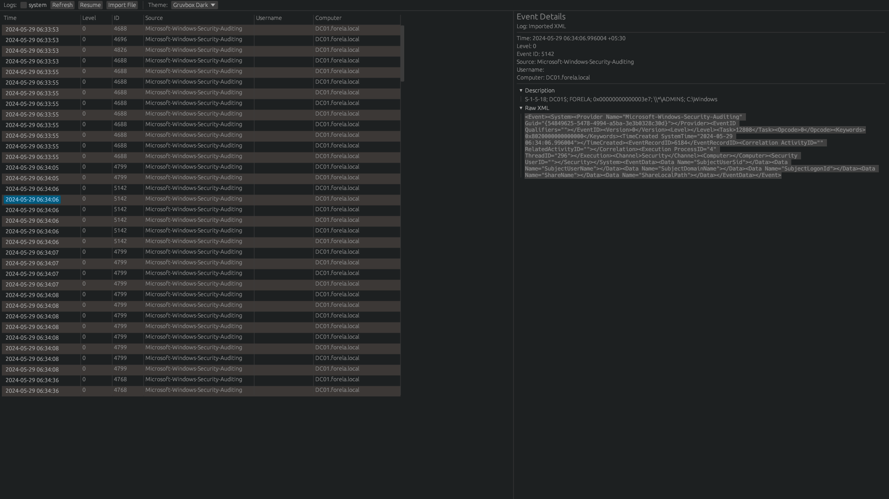
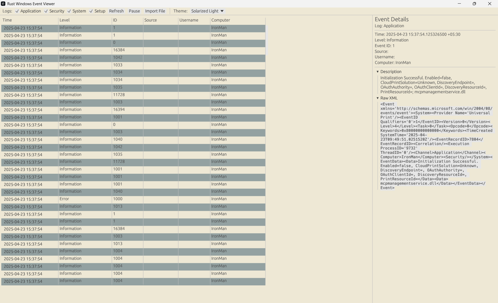

# Rust Windows Event Viewer

[](LICENSE)
[](https://crates.io/crates/eframe)
[](https://github.com/<your‑username>/event_viewer)

A cross‑platform GUI application built in Rust using [`eframe`](https://crates.io/crates/eframe)/[`egui`](https://crates.io/crates/egui) that lets you view Windows Event Logs (and import event files) on macOS, Linux, and Windows.

## 🚀 Features

- **Live Polling:** Poll logs (Application, Security, System, Setup, custom) using `wevtutil` on Windows and `/var/log/syslog` or `system.log` on Unix.
- **Advanced Filtering:** Filter by log name, level, source, event ID, user, computer, keyword, and date range.
- **Sortable Columns:** Easily sort by Time, Level, Event ID, or Source.
- **Live Updates:** Pause and resume live log updates.
- **File Import:** Import input files in `.evtx`, `.xml`, or `.csv` formats.
- **Detailed View:** Inspect event details with formatted descriptions and raw XML/JSON.
- **Multiple Themes:** Included built‑in themes such as Gruvbox, Solarized, Dracula, Nord, and more.
- **Windows Live Monitoring:** Watch Windows events live with real‑time updates as they occur.

## 🎬 Demo

<video controls width="600">
  <source src="Demo.mp4" type="video/mp4">
  <!-- Fallback link -->
  <p>Your browser does not support embedded video. <a href="Demo.mp4">Download the demo</a>.</p>
</video>

[Download Demo Video](Demo.mp4)

## 📸 Screenshots

| Light Theme                                                 | Dark Theme                                                |
|-------------------------------------------------------------|-----------------------------------------------------------|
|                                     |                                  |

### Windows Live Monitoring



## 🛠️ Prerequisites

- **Rust Toolchain (1.60+):** Install via [rustup.rs](https://rustup.rs/).
- **Windows Specific:** Ensure `wevtutil` is in your `PATH` (default on Windows 10+).

## ⚙️ Build & Run

### Run in Debug
```bash
# Clone the repository and navigate into it
git clone https://github.com/Binary-Heker/event_viewer
cd event_viewer

# Run the application in debug mode
cargo run
```

### Build Optimized Binary
```bash
# Build a release version of the binary
cargo build --release

# Run the release binary (change the path accordingly for your OS)
./target/release/event_viewer
```

## 🌍 Cross Compilation

You can cross compile the application for different target platforms. Follow the steps below for your desired target:

### Windows (x86_64-pc-windows-gnu)
1. Install the target:
    ```bash
    rustup target add x86_64-pc-windows-gnu
    ```
2. Build for Windows:
    ```bash
    cargo build --release --target x86_64-pc-windows-gnu
    ```

### macOS (Apple Intel - x86_64-apple-darwin)
1. Install the target:
    ```bash
    rustup target add x86_64-apple-darwin
    ```
2. Build for macOS (Intel):
    ```bash
    cargo build --release --target x86_64-apple-darwin
    ```

### macOS (Apple Silicon - aarch64-apple-darwin)
1. Install the target:
    ```bash
    rustup target add aarch64-apple-darwin
    ```
2. Build for macOS (M1/M2):
    ```bash
    cargo build --release --target aarch64-apple-darwin
    ```

### Linux (x86_64-unknown-linux-gnu)
1. Install the target:
    ```bash
    rustup target add x86_64-unknown-linux-gnu
    ```
2. Build for Linux:
    ```bash
    cargo build --release --target x86_64-unknown-linux-gnu
    ```

> **Note:** Depending on your host system, you may need additional linker tools or libraries to cross compile. Consult the [Rust Cross Compilation Guide](https://doc.rust-lang.org/cargo/guide/cross-compilation.html) for more details.

## 📂 Importing Event Files

Use the **Import File** button in the toolbar to load:
- **`.evtx`** – Windows event log export (via [`evtx`](https://crates.io/crates/evtx))
- **`.xml`**  – Raw Event XML
- **`.csv`**  – Comma‑separated value files

## 💡 Roadmap & Contributing

See [ToDo.md](ToDo.md) for planned features. Contributions, issues, and pull requests are welcome!

1. Fork the repository.  
2. Create a feature branch.  
3. Submit a pull request.

## 📄 License

This project is licensed under the MIT License. See [LICENSE](LICENSE) for details.